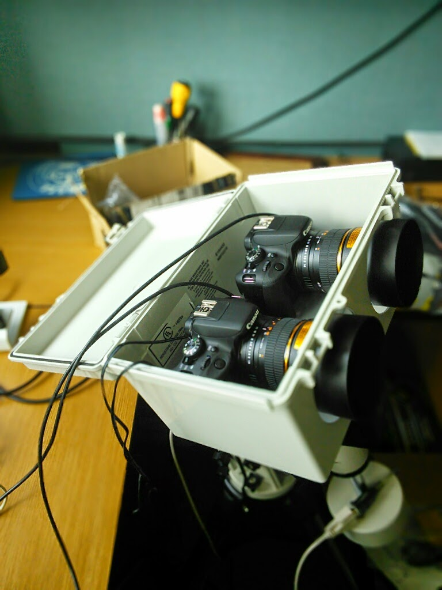

<!-- Carousel ================================================== -->

  <!-- Indicators -->
  <ol class="carousel-indicators">
    <li data-target="#myCarousel" data-slide-to="0" class="active"></li>
    <li data-target="#myCarousel" data-slide-to="1"></li>
    <li data-target="#myCarousel" data-slide-to="2"></li>
  </ol>
  

    

      
      

        

          <h1>Project PANOPTES</h1>
          
The philosophy behind the PANOPTES hardware and software design is to use as many commercial off the shelf (COTS) parts as possible as these are generally inexpensive and easily acquired. In addition, the PANOPTES design is kept as simple as possible as this makes the build process easier and means that the final product is more reliable.

          
<a class="btn btn-lg btn-primary" href="#" role="button">Sign up today</a>

        

      

    

    

      
      

        

          <h1>Get Involved!</h1>
          
Team members on the summit of Mauna Loa with the baseline unit.

          
<a class="btn btn-lg btn-primary" href="#" role="button">Learn more</a>

        

      

    

    

      
      

        

          <h1>Exoplanets</h1>
          
Project status. News1 Pictures! Data!

          
<a class="btn btn-lg btn-primary" href="#" role="button">Browse gallery</a>

        

      

    

  

  <a class="left carousel-control" href="#myCarousel" role="button" data-slide="prev">
    
    Previous
  </a>
  <a class="right carousel-control" href="#myCarousel" role="button" data-slide="next">
    
    Next
  </a>

<!-- /.carousel -->

  <!-- Three columns of text below the carousel -->
  

    

      
      <h2>Heading</h2>
      
Donec sed odio dui. Etiam porta sem malesuada magna mollis euismod. Nullam id dolor id nibh ultricies vehicula ut id elit. Morbi leo risus, porta ac consectetur ac, vestibulum at eros. Praesent commodo cursus magna.

      
<a class="btn btn-default" href="#" role="button">View details &raquo;</a>

    
<!-- /.col-lg-4 -->
    

      
      <h2>Heading</h2>
      
Duis mollis, est non commodo luctus, nisi erat porttitor ligula, eget lacinia odio sem nec elit. Cras mattis consectetur purus sit amet fermentum. Fusce dapibus, tellus ac cursus commodo, tortor mauris condimentum nibh.

      
<a class="btn btn-default" href="#" role="button">View details &raquo;</a>

    
<!-- /.col-lg-4 -->
    

      
      <h2>Heading</h2>
      
Donec sed odio dui. Cras justo odio, dapibus ac facilisis in, egestas eget quam. Vestibulum id ligula porta felis euismod semper. Fusce dapibus, tellus ac cursus commodo, tortor mauris condimentum nibh, ut fermentum massa justo sit amet risus.

      
<a class="btn btn-default" href="#" role="button">View details &raquo;</a>

    
<!-- /.col-lg-4 -->
  
<!-- /.row -->

  <!-- START THE FEATURETTES -->

  

  

    

      <h2 class="featurette-heading">Project PANOPTES Finding exoplanets with digiital cameras.</h2>
      
PANOPTES (Panoptic Astronomical Networked OPtical observatory for Transiting Exoplanets Survey) is a citizen science project which aims to build low cost, robotic telescopes which can be used to detect transiting exoplanets.

    

    

      
    

  

  

  

    

      <h2 class="featurette-heading">Open source. Citizen science Bringing the science to the user.</h2>
      

      The philosophy behind the PANOPTES hardware and software design is to use as many commercial off the shelf (COTS) parts as possible as these are generally inexpensive and easily acquired.  In addition, the PANOPTES design is kept as simple as possible as this makes the build process easier and means that the final product is more reliable.
      

    

    

      
    

  

  

  

    

      <h2 class="featurette-heading">And lastly, this one. Checkmate.</h2>
      

      Due to the simplicity and low cost (an individual PANOPTES unit is targeted to cost about $5000 USD), a Panoptes "unit" can be reproduced quickly and easily by students or amateur scientists.  In this way, many units can be deployed at many different sites to provide continuous and redundant sky coverage.  PANOPTES is designed from the ground up to be a citizen science project which will involve the public in all aspects of the science, from data acquisition to data reduction.

      PANOPTES is also a platform.  We encourage other groups to come up with  projects which use PANOPTES data or PANOPTES hardware to address other scientific questions.
      

    

    

      
    

  

  

  <!-- /END THE FEATURETTES -->
